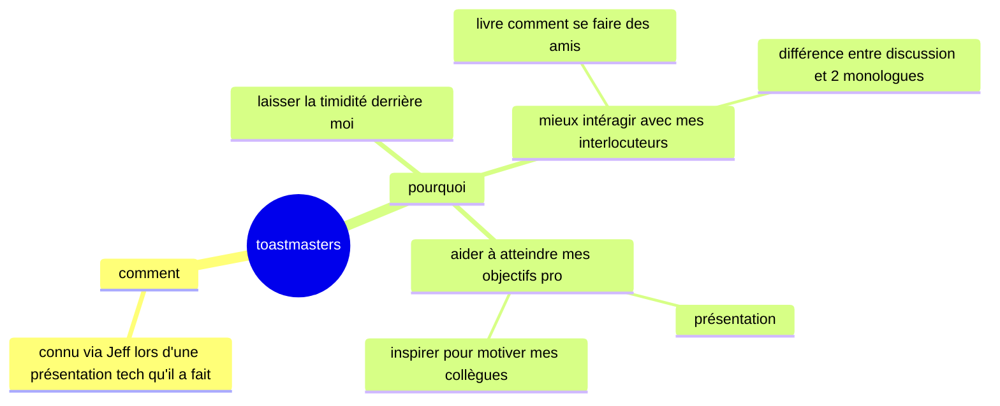
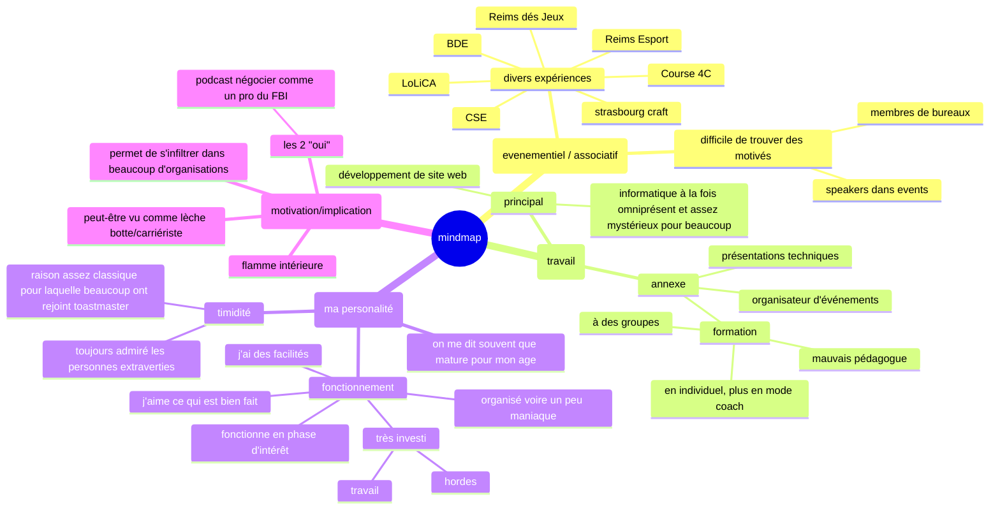

# Mindmap

## Pourquoi / comment toastmasters

```mermaid
mindmap
  root((toastmasters))
    comment
      connu via Jeff lors d'une présentation tech qu'il a fait
    pourquoi
      aider à atteindre mes objectifs pro
        présentation
        inspirer pour motiver mes collègues
      laisser la timidité derrière moi
      mieux intéragir avec mes interlocuteurs
        livre comment se faire des amis
        différence entre discussion et 2 monologues
```

## A propos de moi

```mermaid
mindmap
  root((mindmap))
    subroot(evenementiel / associatif)
      divers expériences
        BDE
        Reims dés Jeux
        LoLiCA
        Reims Esport
        Course 4C
        strasbourg craft
        CSE
      difficile de trouver des motivés
        speakers dans events
        membres de bureaux
    subroot(travail)
      principal
        informatique à la fois omniprésent et assez mystérieux pour beaucoup
        développement de site web
      annexe
        formation
          mauvais pédagogue
          à des groupes
          en individuel, plus en mode coach
        présentations techniques
        organisateur d'événements
    subroot(ma personalité)
      fonctionnement
        fonctionne en phase d'intérêt
        j'aime ce qui est bien fait
        j'ai des facilités
        organisé voire un peu maniaque
        très investi
          hordes
          travail
      timidité
        toujours admiré les personnes extraverties
        raison assez classique pour laquelle beaucoup ont rejoint toastmaster
      on me dit souvent que mature pour mon age
    subroot(motivation/implication)
      les 2 "oui"
        podcast négocier comme un pro du FBI
      permet de s'infiltrer dans beaucoup d'organisations
      flamme intérieure
      peut-être vu comme lèche botte/carriériste
```
