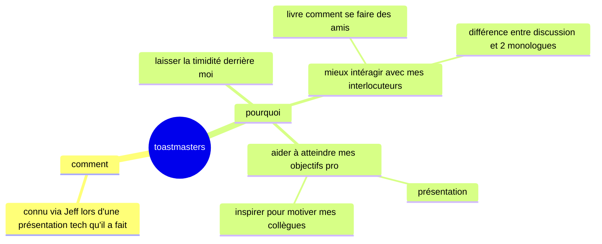
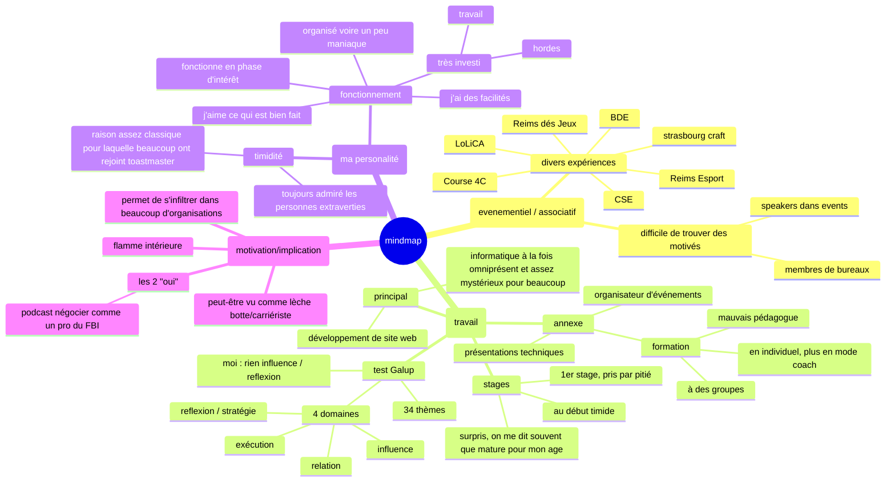

# Mindmaps

## Pourquoi / comment toastmasters

## A propos de moi

[Lien](https://mermaid.live/edit#pako:eNplVcuS20YM_BUUL2tXKbUVe097s9eblF0-xVddIA4oYTMP7jwUOS7_S44r_wZ_LD2URNLyQSUKxGAa3Q3oW9MGI81949Qbx_3aE8UQ8qtX58Dr1zVElMpmjMtevDjxWcXSLXFKoVXO2p3ziIzuJSaSQz8co4pvJV1eEb3_8Dj_-EvUJTLDMdEnKYf5xefwWR_eXSc-pj7EPEcfQolJ6O5hDqUcOW0Q31IbuVsmf3mcAXadtmqFjFCOoQAvHhO5kHUPNIt6vfDftRvDHi2h97x468RtIs6hzKZE4UsLF64AZs9qJ2b6qL7Vnu1cQn0XogN_z0Vo-I8sUxc0UXBe-wgsuJEkV57lX3JfUx5JLQfq0SVtcGkbSj8XBJt7saHvR5EqtKRZ6B_ZXHLYeznIfOIMIPg5hNa4AHoiaGh4G7ZFlm8BtPK1BXf9Ul0i8WgJDlBTxK6otyXVmIPJqA3c7ubkS3vj3YmytDtfaVjUC3HLXhNnQa_mBq0Nx5P7pqQsKdOfbJccvL2jvBte3LLUHZngWP0V3MNwbMt18xDFlmrcZTCK_YWlKJ2VA4KYhGo9iLPVxSkXlO6pDsFcE6nTsUtmyrxdAuNSddyUTFmdmkXFVCJclFaEOx0MrJlSNTCkrg6CkDDiyRsOKSg7n_0dNh9vWlUnQluO1GvW4fizbR1TD88Hz1bR0WTfLvi2MnBSYGmgS7xK3e8YQ2lu1FerDj8WiU83rAANDp6LUhVuU6npWK-SRnd1jBmtAH41xHCkfVA0WnCfFLTtlZ-XHs1xeEkgfY9bdCnZLkTzswfOUzoZqjJer10UC-Wp7hpi4xSuJQt4J4rgJ5iolpCIlbgoHDE-VYFxcFuL73HGR2lsBWuxgC7zCzkzbPEUwBqu45QdPhKvhKn7aTThrbreajs-T_pUVG9o3YSi62YxZ8G0KEYe5sSuhgna4NyJuxjIFPrj_cdpRUl0clobULBTm2NdjnX7TVjNzTSXdXIne1iuZU-6Y0VFmYuW_BucAMH25Xy7HV7aHQgIOcttyzFqPYWem1XjAILV4F_pWy2xbvIOlls393g00nGxuTb4Halccvjy1bfNfcc2yaopvcG6-KC8jezO0e__AwvwTAw) permettant de visualiser le diagramme, github échouant à le convertir en image...

