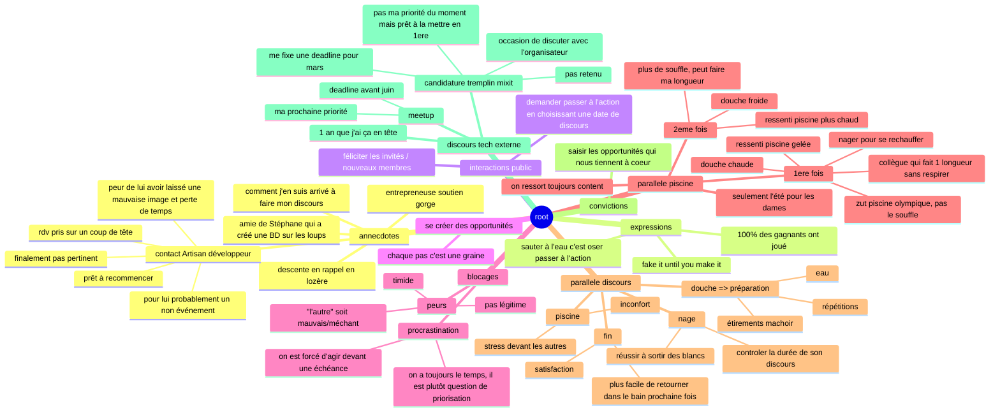

# Mindmaps

## Pourquoi / comment toastmasters

```mermaid
mindmap
  root((root))
    annecdotes
      descente en rappel en lozère
      amie de Stéphane qui a créé une BD sur les loups
      comment j'en suis arrivé à faire mon discours
      entrepreneuse soutien gorge
      contact Artisan développeur
        rdv pris sur un coup de tête
        finalement pas pertinent
        peur de lui avoir laissé une mauvaise image et perte de temps
        pour lui probablement un non événement
        prêt à recommencer
    expressions
      fake it until you make it
      100% des gagnants ont joué
      sauter à l'eau c'est oser passer à l'action
    interactions public
      féliciter les invités / nouveaux membres
      demander passer à l'action en choisissant une date de discours
    se créer des opportunités
      chaque pas c'est une graine
    blocages
      procrastination
        on est forcé d'agir devant une échéance
        on a toujours le temps, il est plutôt question de priorisation
      peurs
        "l'autre" soit mauvais/méchant
        pas légitime
        timide
    parallele piscine
      seulement l'été pour les dames
      1ere fois
        douche chaude
        ressenti piscine gelée
        nager pour se rechauffer
        zut piscine olympique, pas le souffle
        collègue qui fait 1 longueur sans respirer
      2eme fois
        douche froide
        ressenti piscine plus chaud
        plus de souffle, peut faire ma longueur
      on ressort toujours content
    parallele discours
      douche => préparation
        répétitions
        eau
        étirements machoir
      piscine
        stress devant les autres
        inconfort
      nage
        réussir à sortir des blancs
        controler la durée de son discours
      fin
        satisfaction
        plus facile de retourner dans le bain prochaine fois
    convictions
      saisir les opportunités qui nous tiennent à coeur
    discours tech externe
      1 an que j'ai ça en tête
      candidature tremplin mixit
        me fixe une deadline pour mars
        pas ma priorité du moment mais prêt à la mettre en 1ere
        pas retenu
        occasion de discuter avec l'organisateur
      meetup
        deadline avant juin
        ma prochaine priorité
```
